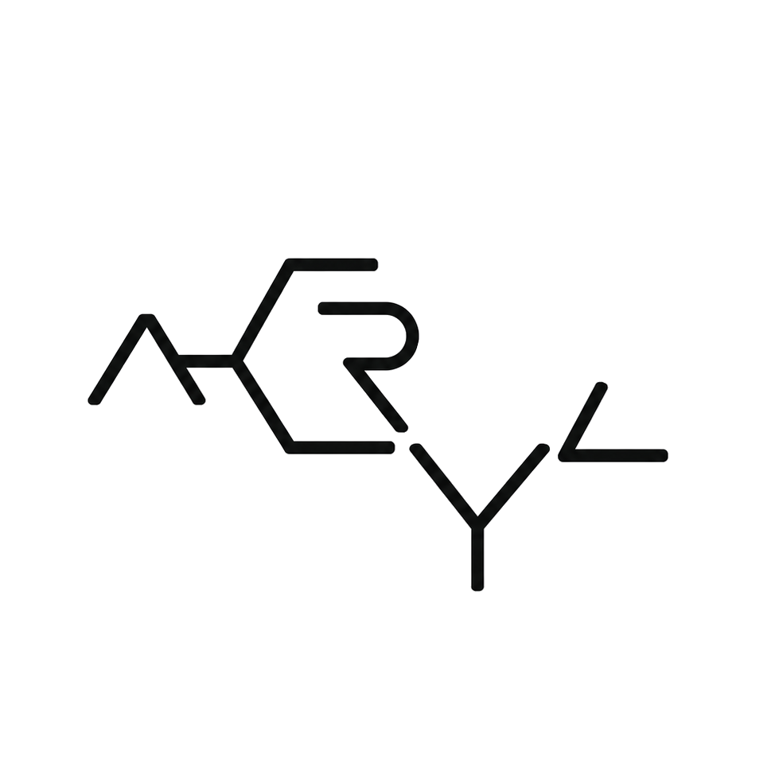

<p align="center">
  
</p>

<h1 align="center">ACRYL — the development environment your agents live in</h1>

<p align="center">
  <strong>ACRYL is a living Agentic Development Environment and runtime for your agents — infinitely adaptive to you, yours to shape, extend and grow into any workflow, any idea, from the inside out, where everything is a plugin.</strong><br>
  Bring any coding agent, it plugs in as a replaceable worker, and every decision, diff, and session survives the swap.
</p>

<p align="center">
  <a href="https://github.com/acryldev/acryl">⭐ Star ACRYL</a> ·
  <a href="https://acryl.dev/">Website</a> ·
  <a href="https://acryl.dev/docs">Documentation</a> ·
  <a href="https://github.com/acryldev/acryl/releases/tag/v0.2.2">Download v0.2.2</a> ·
  <a href="https://discord.gg/cY9KXMex69">Discord</a>
</p>

<p align="center">
  <a href="https://github.com/acryldev/acryl"></a>
  <a href="LICENSE"></a>
  <a href="https://discord.gg/cY9KXMex69"></a>
  
</p>

> [!IMPORTANT]
> ACRYL is in active early development. Interfaces, workflows, and packaging may change while the first public foundation is established.

## Why ACRYL?

You don't use one coding agent anymore. You use Claude Code for this, Codex for that, a terminal agent for the quick fix — and every switch costs you the context, the setup, and the thread of the work.

ACRYL flips the relationship. Instead of your project living inside one agent's chat, agents live inside your project:

```text
Same project
Same context
Same work
Different agents
```

Claude Code, Codex, OpenCode, Pi, Gemini CLI, DeepSeek Harness agents, ACP-compatible agents, plain PTY tools — even agents that don't know ACRYL exists. They are replaceable workers entering and leaving one persistent development scene. ACRYL owns the workspace, the context, the tasks, and the handoffs.

## What you get

**🖼️ A real canvas, not a chat window.** Projects and git worktrees on the left, a tabbed canvas in the middle: agent sessions, native terminals, a file editor, diffs with line-by-line review comments you can send straight back to the agent, a draggable kanban for your notes, docs, and checks. Panes are tiles — open, close, and arrange the environment around the work.

**🤖 Every agent, one roster.** A built-in catalog of 33 coding agents you can launch into any project, plus your own custom agent definitions. An attention queue tells you the moment an agent needs you (Claude Code hooks ship today), so you can run several and stop babysitting terminals.

**🎮 Agents that can drive the app.** Agent Control gives the agent inside ACRYL computer-use-style command of ACRYL itself: it reads the accessibility tree, clicks, types, opens panels, enables or disables plugins — every mutating action approved by you per call, recorded in an audit log, stoppable with one key. From the outside, the same power in your terminal: `acryl control` drives a running app, and `acryl doctor` / `acryl repair` diagnose and fix an install that won't boot, with backups and undo.

**🧩 Everything is a plugin — really.** Built on [Cordis](https://github.com/cordiverse/cordis), the meta-framework of spatiotemporal composability. Install and hot-reload plugins live across all three surfaces without restarting. Plugins can contribute their own canvas tab types, tools, slots, and services. Browse the ecosystem at [cordisplugins.github.io](https://cordisplugins.github.io).

**🥤 Blends: whole setups, shareable.** A Blend is a complete, pullable composition of plugins — an entire opinionated environment as one unit. ACRYL itself is just one Blend, the maxed-out one. Yours can be another. See [acrylblends.github.io](https://acrylblends.github.io).

**🖥️ Three surfaces, one brain.** Desktop (Electron), local Web (`acryl web`), and the terminal UI are peers rendering the same runtime — same project model, same plugins, same capabilities. Use whichever fits the moment; the work is the same.

## Install ACRYL v0.2.2

The three surfaces are deliberately separate installs — installing one never silently installs or starts another.

### Desktop GUI

| Platform | Desktop download |
| --- | --- |
| macOS — Apple Silicon | [DMG](https://github.com/acryldev/acryl/releases/download/v0.2.2/acryl-desktop-mac-arm64.dmg) |
| macOS — Intel | [DMG](https://github.com/acryldev/acryl/releases/download/v0.2.2/acryl-desktop-mac-x64.dmg) |
| Windows — x64 | [Installer](https://github.com/acryldev/acryl/releases/download/v0.2.2/acryl-desktop-win-x64.exe) |
| Linux — x64 / Debian | [DEB](https://github.com/acryldev/acryl/releases/download/v0.2.2/acryl-desktop-linux-amd64.deb) |
| Linux — arm64 / Debian | [DEB](https://github.com/acryldev/acryl/releases/download/v0.2.2/acryl-desktop-linux-arm64.deb) |

The Desktop app carries the runtime it needs; it does not add `acryl` to your PATH or leave a web server running after exit.

### CLI terminal

One command, no Node.js required, adds `acryl` to your PATH and verifies the checksum:

```bash
curl -fsSL https://acryl.dev/install | bash
acryl
```

Prefer npm? It works, but npm 11+ prints advisory `install-scripts` warnings for ACRYL's native dependencies (`node-pty`, `koffi`, and others). These are npm security notices, not ACRYL errors. To install without them:

```bash
npm install -g acryl --allow-scripts=@deepseek-ai/dsh-subprocess-local,@google/genai,koffi,node-pty,protobufjs
acryl
```

### Local Web surface

```bash
acryl web
```

Starts a local web runtime, prints its URL, and serves until you stop it. It is not a hosted cloud service.

### Nix (Flake)

```bash
nix run github:acryldev/acryl              # TUI, built from source
nix run github:acryldev/acryl#acryl-desktop # Desktop GUI
nix profile install github:acryldev/acryl  # install to your profile
```

The flake exposes `packages.<system>.acryl` (also `#default`), `.prebuilt` (prebuilt binary with bundled Node runtime; `x86_64-linux`, `aarch64-linux`, `aarch64-darwin`), `.acryl-desktop`, and `devShells.<system>.default`.

## Core principles

1. **Agent sessions are disposable. Project context is persistent.**
2. **ACRYL owns continuity. Agents perform work.**
3. **Canonical state is durable and agent-independent.**
4. **Agent-specific context is a projection, not the source of truth.**
5. **Everything practical is a plugin or replaceable capability.**
6. **Capabilities are versioned, permissioned, testable, and auditable.**

## Architecture at a glance

```text
              ACRYL product surfaces
         Desktop  ·  CLI terminal  ·  Local Web
                        |
              ACRYL-owned capabilities
       (workspace, agent control, continuity)
                        |
        DeepSeek Harness capability substrate
       (sessions, agents, tools, LLMs, PTYs)
                        |
      Cordis lifecycle and composition runtime
                        |
            Node.js / Electron / OS
```

The trusted kernel stays small and boring. New functionality arrives as versioned capability packages that can be validated, activated, observed, and rolled back without touching the core.

## DeepSeek Harness lineage

ACRYL builds on an unmodified, pinned [DeepSeek Harness](https://github.com/deepseek-ai/deepseek-harness) checkout as its capability substrate — sessions, tools, PTYs, sandboxing, Web composition — while remaining an independent product with a broader goal: persistent, cross-agent development continuity. The pinned upstream lives read-only in `deepseek-harness/`.

ACRYL is not affiliated with, authorized by, or endorsed by DeepSeek.

## Run from source

Requirements: Node.js `^22.19.0` or `>=24.0.0`, Corepack (selects the pinned PNPM 11.11.0).

```sh
corepack pnpm run upstream:sync
corepack pnpm install --frozen-lockfile
corepack pnpm dev
```

`corepack pnpm dev` builds and launches the isolated local Desktop (own `~/.acryl-dev` home, advanced mode, Development Canvas). Other essentials:

- `corepack pnpm run verify` — fast headless loop (typecheck + tests)
- `corepack pnpm run check` — complete headless gate, use before handoff
- `corepack pnpm run web` / `corepack pnpm run tui` — the other surfaces

Repository layout: `apps/` (the surfaces), `runtime/` (the stable core), `plugins/` (replaceable capability packages), `distribution/` (release shims), `deepseek-harness/` (pinned upstream submodule — never edited from a feature branch).

## Project links

- Website: [acryl.dev](https://acryl.dev/) · Documentation: [acryl.dev/docs](https://acryl.dev/docs)
- ACRYL Blends: [acrylblends.github.io](https://acrylblends.github.io) · Cordis Plugins: [cordisplugins.github.io](https://cordisplugins.github.io)
- Discord: [discord.gg/cY9KXMex69](https://discord.gg/cY9KXMex69)
- Cordis: [github.com/cordiverse/cordis](https://github.com/cordiverse/cordis) · DeepSeek Harness: [github.com/deepseek-ai/deepseek-harness](https://github.com/deepseek-ai/deepseek-harness)

## Contributing

ACRYL welcomes contributors interested in agent interoperability, persistent context, Cordis plugins, developer tooling, terminals, editors, dynamic UI, security, and self-extensible software.

Before contributing, read [`AGENTS.md`](AGENTS.md), the [ACRYL orientation](docs/onboarding/orientation_spec_acryl.md), and the [Cordis specification](docs/cordis/cordis_spec.md). Join the [Discord](https://discord.gg/cY9KXMex69) to discuss the project.

## Contributors

Thanks to everyone building ACRYL — every report, idea, and PR counts:

<a href="https://github.com/acryldev/acryl/graphs/contributors">
  
</a>

Who did what, by name: [CONTRIBUTORS.md](CONTRIBUTORS.md) ([中文](CONTRIBUTORS.zh.md)). Your name belongs here — see [CONTRIBUTING.md](CONTRIBUTING.md).

## License

ACRYL is licensed under the [MIT License](LICENSE).

## Acknowledgements

ACRYL builds on the work of the [Cordis](https://github.com/cordiverse/cordis) community and continues architectural inspiration from [DeepSeek Harness](https://github.com/deepseek-ai/deepseek-harness). We are grateful to both projects and to the broader open-source coding-agent ecosystem.
