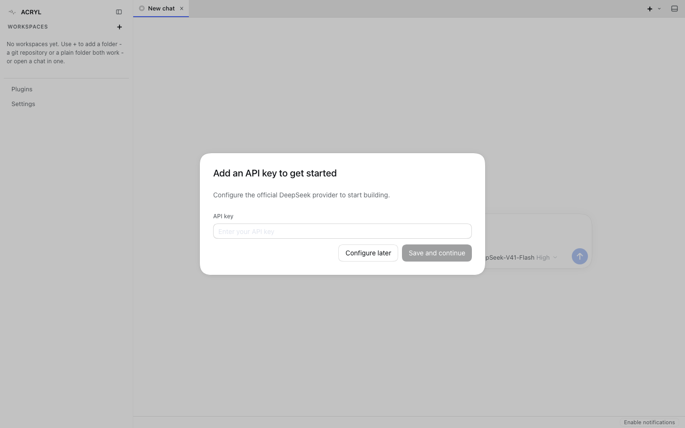
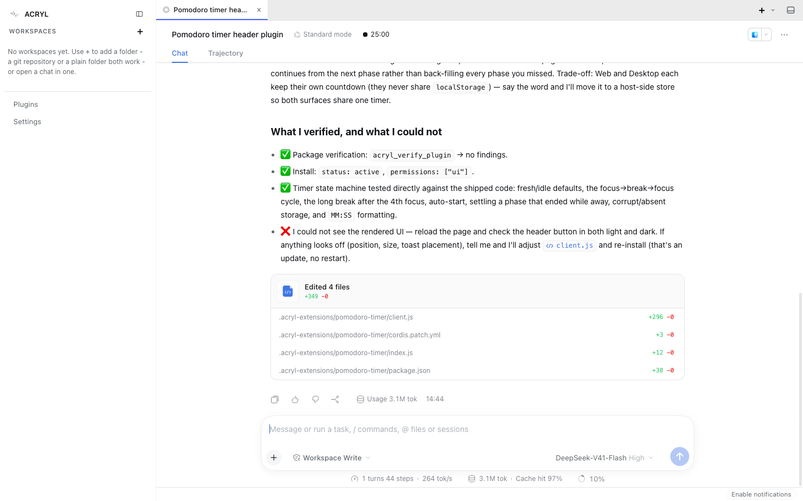

# Demo runbook: an agent writes a plugin and the running app takes it live

Everything below was run for real on 2026-10-09 against release v0.2.2 with the DeepSeek model, in an isolated home. Where a step was only checked at the tool level and not with the model, it says so. Rehearse the whole thing once on the demo machine the day before.

## What the audience sees (the 30 second version)

You install ACRYL from a download, with no dev server and no source checkout. You type one sentence: "Write a Pomodoro timer plugin for me". The agent reads ACRYL's own plugin documentation, writes a four-file plugin, verifies it, installs it into the running app, and a live countdown button appears in the conversation header. You then change it with another sentence, and it updates in place, with no restart.

## Before the day

1. Pick the machine and install a build from https://github.com/acryldev/acryl/releases/latest (every asset name ends with the version, for example `acryl-desktop-mac-arm64-v0.2.3.dmg`):
   - macOS Apple silicon: the `mac-arm64` DMG. Intel: the `mac-x64` DMG.
   - Windows 10 or 11: the `win-x64` installer.
   - Ubuntu or Debian: `sudo apt install ./acryl-desktop-linux-amd64-v<version>.deb` (or `arm64`), then start "ACRYL" from the launcher. On Ubuntu 24.04 the package installs its own AppArmor profile, so nothing else is needed.
   - Terminal only: `curl -fsSL https://acryl.dev/install | bash` (Apple silicon and Linux), then `acryl`. Windows: `npm install -g acryl`.
2. The first launch of an unsigned build shows a system warning. This is expected until we sign the builds:
   - macOS: open System Settings, Privacy & Security, scroll down and choose "Open Anyway" for ACRYL. Or run `xattr -dr com.apple.quarantine /Applications/ACRYL.app` once.
   - Windows: SmartScreen shows "More info", then "Run anyway".
3. Have a DeepSeek API key ready. It is entered once in the app (below). Do not paste it on screen: set it before the talk.
4. Do one full dry run. For a rehearsal that cannot touch your real ACRYL data, from a source checkout run `node scripts/live-run.mjs web` (isolated home, the key is read from `~/.secure-storage/llmproviders/deepseek/deepseek.json` and passed by environment only), and open the URL it prints.

## First launch, in order

1. "Add an API key to get started": paste the DeepSeek key and click **Save and continue**. The model shown is DeepSeek-V41-Flash with High reasoning, which is what the timings below used.

   

## On stage

1. Click into the message box and send:

   > Write a Pomodoro timer plugin for me. Put a button with the running countdown in the conversation header. Install it so it is live right now.

2. Narrate while it works (it took 2 minutes 50 seconds and 44 steps in the rehearsal): it works out how plugins fit the app, then writes `.acryl-extensions/pomodoro-timer/` (`package.json`, `cordis.patch.yml`, `index.js`, `client.js`), runs `acryl_verify_plugin` (no findings), then `acryl_install_plugin` (status `active`). The **Trajectory** tab next to **Chat** shows every step if someone asks how.
3. The header gets a countdown button ("25:00") next to the session title. In the rehearsal it appeared without reloading the page; the agent's own message says to reload with Cmd+R or Ctrl+R if you do not see it, so keep that as the fallback.

   

4. Click the button to open the timer panel (start, pause, reset, skip, focus length, auto-start).
5. Change it live (checked at the tool level, not yet with the model: rehearse it): for example "Make the default focus 30 minutes and show the session count on the button". The agent edits `client.js` and calls `acryl_install_plugin` again. That is an update with no restart.
6. Remove it: "Remove the Pomodoro plugin". The agent calls `acryl_remove_plugin`.

## If something goes wrong

| Symptom | What to do |
| --- | --- |
| The button does not appear | Reload the page or window (Cmd+R or Ctrl+R). If it still does not, open the **Plugins** page in the sidebar: the plugin should be listed as active. |
| The agent is slow to start | The first turn explores for about a minute. Say "take your time, I will wait" and show the **Trajectory** tab. |
| "Add an API key" dialog keeps returning | The key was not saved: paste it again, or choose "Configure later" and set it in Settings. |
| The model is unreachable | Check the network. The app runs fully locally except for the model calls; keep a short screen recording of the run above as a fallback. |
| macOS says the app is damaged or from an unidentified developer | See "Before the day", step 2. |
| Linux: nothing happens on launch | Start `acryl-desktop` from a terminal and read the first lines of output. On a machine with an unusual security policy add `--no-sandbox` for the demo only. |

## Known limits to say out loud (or avoid)

- macOS and Windows builds are not code-signed yet, so the first launch needs the steps above.
- Linux uses the standard (compatibility) shell; the advanced workspace shell is macOS and Windows.
- The terminal installer has no Intel Mac build; Intel Macs use the Desktop DMG.
- `acryl new` writes a POSIX launcher; there is no Windows launcher for a generated app yet.

## How this was verified

- `apps/acryl-desktop/scripts/verify-packaged-self-extension.mjs` boots a packaged app (macOS `.app`, Windows install, Linux `.deb`) and drives the agent's own tools without a model: verify, install, call the new tool, rewrite and update it, call it again, remove it. It runs for every release on each OS.
- The model run above used `scripts/live-run.mjs web` and a headless browser, with the model key passed by environment only; the run checked afterwards that the real ACRYL homes were untouched.
