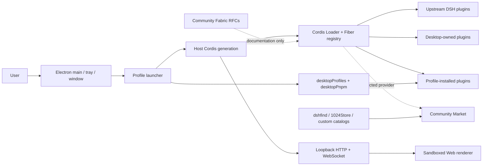
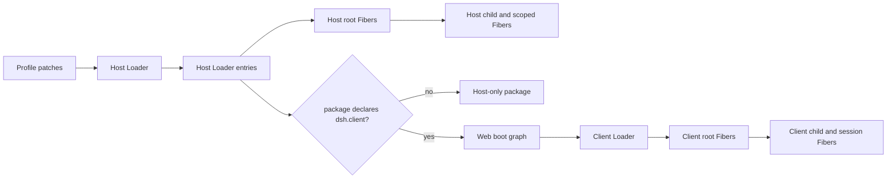

# DSH Desktop Architecture

## Overview

DSH Desktop is a thin Electron host. It starts the official DSH Host in Electron's main process; the Host exposes the ordinary Web UI over loopback HTTP/WebSocket. Desktop does not create a second renderer IPC plugin system and does not expose raw Electron APIs to the page.

## Repository components and runtime status

### `deepseek-harness/`

This is the pinned, read-only upstream source submodule and an independent pnpm
workspace. It is the architectural reference and verification source, but the
Desktop does not load the submodule directory as one giant plugin. The shipped
application consumes the published `@deepseek-ai/dsh-*` and Cordis packages
pinned in the outer PNPM workspace. The default Desktop profile names
`@deepseek-ai/dsh-base` and `@deepseek-ai/dsh-web-app` as its two direct
bundles; their patches expand into the upstream Host, Client, agent, session,
tool, storage, sandbox, and Web rows.

### `dsh-plugin-desktop/`

This is the executable Desktop product package. It provides:

- a Host plugin at `dsh-plugin-desktop`;
- a Web Client face at `dsh-plugin-desktop/client`;
- public Desktop service contracts at `profile-service` and `pnpm`;
- Desktop-owned Host subpath plugins; and
- the Electron bootstrap, native adapters, packaging, recovery, and release
  verification.

Its package declares `dsh.bundle.patch = ./cordis.patch.yml`. The launcher
inserts that patch immediately after the upstream Web bundle in every
generation, rather than adding Desktop to the user's profile bundle list.

The clean Desktop composition currently contributes these ten Loader rows:

- `desktop-shell` → `dsh-plugin-desktop`
- `desktop-terminal` → `dsh-plugin-desktop/terminal`
- `desktop-hello-world` → `dsh-plugin-desktop/hello-world` (R&D fixture)
- `desktop-development-canvas` → `dsh-plugin-development-canvas`
- `desktop-diagnostics` → `dsh-plugin-desktop/diagnostics`
- `desktop-notifications` → `dsh-plugin-desktop/notifications`
- `desktop-pnpm` → `dsh-plugin-desktop/pnpm`
- `desktop-profiles` → `dsh-plugin-desktop/profiles`
- `desktop-updates` → `dsh-plugin-desktop/updates`
- `desktop-webserver` → `dsh-plugin-desktop/webserver` (profile-generated)

Launcher-owned services do not all appear as Loader rows. The launcher provides
`desktopRuntime` and `desktopPnpmBootstrap` directly, and mounts
`desktopActions` and `desktopProfiles` through `ctx.plugin(...)` before or
alongside the Loader tree. These are still Cordis lifecycle-managed services,
but they have a different provenance from declarative Loader entries.

### `dsh-plugin-development-canvas/`

Development Canvas is a standalone Host/Client Cordis package. Its own bundle
patch inserts `desktop-development-canvas`; its Host Fiber owns PTY routes and
processes, and its Client Fiber contributes through the Desktop-owned
`desktop.main` slot. Desktop provides only the advanced frame and conversation
fallback. Removing the Canvas row restores that fallback without polling or a
Desktop import of Canvas implementation.

### `dsh-community-market/`

Community Market is implemented, private, and built into this workspace. It has
a Host entry, a Client entry, catalog contracts, persisted source selection,
reviewed dshfind and 1024Store adapters, restricted network access, and managed
Desktop package operations.

It is an optional provider, not an always-active plugin. A fresh installation
defaults Market selection to `disabled`. Selecting `community-market` for the
next generation:

1. inserts `community-market` → `dsh-community-market` into the Loader tree;
2. mounts the launcher-owned `desktopPlugins` service for direct profile-bundle
   inventory and enable/disable operations; and
3. activates the Market Client contributions for Settings, sidebar, and shell
   overlay surfaces.

The alternative provider identity is `dsh-market` → `dshmarket`. Exactly one
Market provider may be effective in a generation.

### `dsh-community-fabric/`

Community Fabric is a private, documentation-only interoperability proposal.
It currently has no runtime entry, package export, `dsh.bundle` declaration,
schema release, SDK, or conformance runtime. It therefore never appears in the
Loader or Fiber registry. Current plugins continue to use existing DSH and
Cordis contracts; Fabric RFCs describe possible future cross-host contracts.

## What “plugin registry” means

There is no single registry that means every possible plugin. The current
system has four related views:

1. **Cordis runtime registry (`ctx.registry`)** - low-level Runtime/Fiber
   instances and their lifecycle states. It includes declarative Loader plugins
   and plugins mounted from code.
2. **Loader inventory (`ctx.loader` / `pluginInventory/list`)** - the effective
   non-group Loader entries in order, with row id, module specifier, effective
   enablement, and current root Fiber phase. The Web Settings **Plugin list**
   tab is a read-only projection of this snapshot.
3. **Profile bundle inventory (`dsh.profile.bundles` / `desktopPlugins`)** -
   package-level bundles installed directly in the active profile. Each bundle's
   `dsh.bundle.patch` may expand into many Loader rows. The Desktop-owned
   inventory can disable mutable direct bundles, but it does not replace the
   Loader as lifecycle authority.
4. **Community Market catalog** - remote discovery candidates from one
   user-selected source. Built-in source adapters exist for DSH 1024Store and
   dshfind, and standard conforming HTTP sources can be added. Catalog presence
   does not mean installed, enabled, active, compatible, reviewed, or safe.

## Host and Client plugin planes

The application has two separate Cordis runtime contexts. “Host” means the
Node.js runtime inside the Electron main process; Electron is the native shell,
not a separate “Electron.js” framework. “Client” means the sandboxed Chromium
renderer running the compiled React and TypeScript Web application.

The planes do not share `ctx`, services, objects, or Fibers. They communicate
through the loopback HTTP, WebSocket, Remote, and generated client-module
boundaries. One npm package can have one Host face, one Client face, or both.
The Development Canvas package is dual-faced: its Host Fiber owns `node-pty`
processes and routes, while its Client Fiber owns the React Canvas, xterm.js,
styles, tabs, and `desktop.main` slot contribution.

### Entry, package, plugin, and Fiber are different

- A **package** is the installed npm unit and may export `.` and `./client`.
- A **Loader entry** is one configured row with an id, module specifier,
  configuration, and `disabled` state. The same package may occur in several
  entries.
- A **plugin** is the Cordis definition imported by an entry or mounted from
  code with `ctx.plugin(...)`.
- A **Fiber** is one live lifecycle instance of a plugin. An enabled Loader
  entry normally owns one root Fiber, but that Fiber may mount child Fibers.
  Session and agent scopes may create and dispose additional Fibers at runtime.

Consequently, the 174 rows shown by Plugin Inventory are not 174 packages
copied into both planes, nor are they the complete Fiber registry. They are the
current Host Loader rows after structural group rows have been omitted.

### Enable, disable, and reload semantics

A correct lifecycle control must operate through the Loader, not hide React
components. Disable must persist `disabled: true`, dispose the Host root Fiber
and every owned child effect, retract its client package from the Web graph,
dispose the current Client root Fiber and its children, remove owned styles and
slots, and reveal any lower-priority fallback. Enable performs the reverse from
the same canonical configuration. Reload disposes and rematerializes both
faces without duplicating routes, processes, styles, services, or slot entries.

The existing upstream Plugin Inventory remains read-only and reports only Host
root Fiber phases. ACRYL now adds a separate **Lifecycle** tab through the
Desktop Client plugin. Every Host Loader row is visible there with
configuration, Host phase, Client-face capability, current Client phase, and a
mutation-policy explanation.

`PluginLifecycleController` is owned by the protected Desktop Host plugin, not
by Canvas. It persists admitted entry overrides in Desktop-private state,
updates the live Host Entry without invoking Loader tree write-back, awaits
Fiber settlement, and returns a bounded receipt. The Client then reloads the
renderer so it boots from the recomposed Web graph. This renderer reload is
required because the pinned HMR path reloads changed bundle content but does
not provide complete live graph add/remove reconciliation.

Development Canvas is the first admitted mutable entry. Its Lifecycle card
offers Enable, Disable, and Reload. All other internal, nested, generated, or
dependency-critical rows remain visible but protected until they have a stable
persistence identity and an independently proved recovery path. The same Host
controller registers `/reload [loader-entry-id]`; no argument reloads every
currently mounted managed ACRYL plugin and requests an orderly Desktop restart.
A Canvas toggle implemented inside Canvas remains invalid because disabling
Canvas would remove the only code capable of enabling it again.

## Live plugin and root Fiber inventory

This section is a point-in-time runtime snapshot captured on 2026-08-25 from
the running macOS advanced Desktop profile. The Host list came from the
`pluginInventory/list` Remote, which reads `ctx.loader.entries()` directly.
The Client list came from the exact `window.__DSH_BOOT__` graph served by that
same Host generation. The running renderer had completed boot; Client Web boot
waits for every graph entry Fiber to become active before mounting the app.

Snapshot totals:

- Host Loader entries: **174**.
- Host active root Fibers: **143**.
- Host disabled rows with no root Fiber: **31**.
- Host pending, loading, failed, or unloading root Fibers: **0**.
- Client graph entries and active root Fibers: **43**.
- Client immediate-prefetch entries: **10**.

These lists are exact for that generation, not permanent product constants.
Profile choice, platform, Market provider, plugin installation, configuration,
and runtime lifecycle changes can change them.

### Complete Host Loader entry and root Fiber snapshot

Each line is `entry id` -> `module specifier` - configuration - root Fiber
phase - whether that exact package specifier also appears in the Client graph.
“no Fiber” is an expected disabled row, not a failed Fiber.

Show all 174 Host Loader entries and root Fiber states

- `include` -> `cordis:include` - enabled - `active` - Client graph: no
- `include:timer` -> `@deepseek-ai/cordis-plugin-timer` - enabled - `active` - Client graph: no
- `include:hmr` -> `@deepseek-ai/cordis-plugin-hmr` - disabled - `no Fiber` - Client graph: no
- `include:llm` -> `@deepseek-ai/dsh-llm` - enabled - `active` - Client graph: no
- `include:session` -> `@deepseek-ai/dsh-session` - enabled - `active` - Client graph: no
- `include:typert` -> `@deepseek-ai/dsh-typert-registry` - enabled - `active` - Client graph: yes
- `include:typert-loader` -> `@deepseek-ai/dsh-typert-loader` - enabled - `active` - Client graph: no
- `include:typert-gateway` -> `@deepseek-ai/dsh-api-gateway` - enabled - `active` - Client graph: yes
- `include:session-title` -> `@deepseek-ai/dsh-session-title` - enabled - `active` - Client graph: no
- `include:session-title-llm` -> `@deepseek-ai/dsh-session-title-first-prompt-llm` - enabled - `active` - Client graph: no
- `include:user-questions` -> `@deepseek-ai/dsh-user-questions` - enabled - `active` - Client graph: no
- `include:agent` -> `@deepseek-ai/dsh-agent` - enabled - `active` - Client graph: no
- `include:agent-default-model` -> `@deepseek-ai/dsh-agent-default-model` - enabled - `active` - Client graph: no
- `include:jobs` -> `@deepseek-ai/dsh-jobs-local` - enabled - `active` - Client graph: no
- `include:llm-retry` -> `@deepseek-ai/dsh-llm-retry` - enabled - `active` - Client graph: no
- `include:settings` -> `@deepseek-ai/dsh-settings-file` - enabled - `active` - Client graph: no
- `include:credentials` -> `@deepseek-ai/dsh-credentials-local` - enabled - `active` - Client graph: no
- `include:llm-pi-ai` -> `@deepseek-ai/dsh-llm-pi-ai` - enabled - `active` - Client graph: no
- `include:session-persistence-jsonl` -> `@deepseek-ai/dsh-session-persistence-jsonl` - enabled - `active` - Client graph: no
- `include:attachment-local` -> `@deepseek-ai/dsh-attachment-local` - enabled - `active` - Client graph: no
- `include:session-query-sqlite` -> `@deepseek-ai/dsh-session-query-sqlite` - enabled - `active` - Client graph: no
- `include:session-projection` -> `@deepseek-ai/dsh-session-projection` - enabled - `active` - Client graph: no
- `include:session-telemetry-otel` -> `@deepseek-ai/dsh-session-telemetry-otel` - enabled - `active` - Client graph: no
- `include:subprocess` -> `@deepseek-ai/dsh-subprocess-local` - enabled - `active` - Client graph: no
- `include:sandbox` -> `@deepseek-ai/dsh-sandbox-local` - enabled - `active` - Client graph: no
- `include:sandbox-policy` -> `@deepseek-ai/dsh-sandbox-policy` - enabled - `active` - Client graph: no
- `include:bash-sandbox` -> `@deepseek-ai/dsh-bash-sandbox` - enabled - `active` - Client graph: no
- `include:pwsh-sandbox` -> `@deepseek-ai/dsh-pwsh-sandbox` - disabled - `no Fiber` - Client graph: no
- `include:approval` -> `@deepseek-ai/dsh-user-approval` - enabled - `active` - Client graph: no
- `include:permission` -> `@deepseek-ai/dsh-permission-presets` - enabled - `active` - Client graph: no
- `include:shell-env` -> `@deepseek-ai/dsh-shell-env` - enabled - `active` - Client graph: no
- `include:tool-bash` -> `@deepseek-ai/dsh-tool-bash` - disabled - `no Fiber` - Client graph: no
- `include:tool-pwsh` -> `@deepseek-ai/dsh-tool-pwsh` - disabled - `no Fiber` - Client graph: no
- `include:tool-jobs` -> `@deepseek-ai/dsh-tool-jobs` - disabled - `no Fiber` - Client graph: no
- `include:fs-observation-policy` -> `@deepseek-ai/dsh-fs-observation-policy` - enabled - `active` - Client graph: no
- `include:tool-fs` -> `@deepseek-ai/dsh-tool-fs` - disabled - `no Fiber` - Client graph: no
- `include:tool-fs-search` -> `@deepseek-ai/dsh-tool-fs-search` - disabled - `no Fiber` - Client graph: no
- `include:agent-instructions` -> `@deepseek-ai/dsh-agent-instructions` - disabled - `no Fiber` - Client graph: no
- `include:skill` -> `@deepseek-ai/dsh-skill` - enabled - `active` - Client graph: no
- `include:skill-filesystem` -> `@deepseek-ai/dsh-skill-filesystem` - disabled - `no Fiber` - Client graph: no
- `include:skill-badge` -> `@deepseek-ai/dsh-skill-badge` - disabled - `no Fiber` - Client graph: no
- `include:tool-skill` -> `@deepseek-ai/dsh-tool-skill` - disabled - `no Fiber` - Client graph: no
- `include:commands` -> `@deepseek-ai/dsh-commands` - enabled - `active` - Client graph: no
- `include:command-feedback` -> `@deepseek-ai/dsh-command-feedback` - enabled - `active` - Client graph: no
- `include:goal` -> `@deepseek-ai/dsh-goal` - enabled - `active` - Client graph: no
- `include:goal-round-driver` -> `@deepseek-ai/dsh-goal-round-driver` - enabled - `active` - Client graph: no
- `include:command-goal` -> `@deepseek-ai/dsh-command-goal` - enabled - `active` - Client graph: no
- `include:plan-mode` -> `@deepseek-ai/dsh-plan-mode` - disabled - `no Fiber` - Client graph: no
- `include:token-meter` -> `@deepseek-ai/dsh-token-meter` - enabled - `active` - Client graph: no
- `include:compaction-basic` -> `@deepseek-ai/dsh-compaction-basic` - disabled - `no Fiber` - Client graph: no
- `include:command-compact` -> `@deepseek-ai/dsh-command-compact` - disabled - `no Fiber` - Client graph: no
- `include:subagent` -> `@deepseek-ai/dsh-subagent` - enabled - `active` - Client graph: no
- `include:subagent-spawn-in-process` -> `@deepseek-ai/dsh-subagent-spawn-in-process` - enabled - `active` - Client graph: no
- `include:subagent-fork-in-process` -> `@deepseek-ai/dsh-subagent-fork-in-process` - enabled - `active` - Client graph: no
- `include:tool-subagent-control` -> `@deepseek-ai/dsh-tool-subagent-control` - disabled - `no Fiber` - Client graph: no
- `include:tool-subagent-list-agents` -> `@deepseek-ai/dsh-tool-subagent-control/list-agents` - disabled - `no Fiber` - Client graph: no
- `include:tool-subagent` -> `@deepseek-ai/dsh-tool-subagent` - disabled - `no Fiber` - Client graph: no
- `include:tool-subagent-fork` -> `@deepseek-ai/dsh-tool-subagent` - disabled - `no Fiber` - Client graph: no
- `include:tool-subagent-report` -> `@deepseek-ai/dsh-tool-subagent-report` - enabled - `active` - Client graph: no
- `include:workflow-worker-thread` -> `@deepseek-ai/dsh-workflow-worker-thread` - disabled - `no Fiber` - Client graph: no
- `include:tool-workflow` -> `@deepseek-ai/dsh-tool-workflow` - disabled - `no Fiber` - Client graph: no
- `include:timeout-policy` -> `@deepseek-ai/dsh-tool-call-timeout-policy` - enabled - `active` - Client graph: no
- `include:spill-local` -> `@deepseek-ai/dsh-spill-local` - enabled - `active` - Client graph: no
- `include:spill-policy` -> `@deepseek-ai/dsh-spill-policy` - enabled - `active` - Client graph: no
- `include:session-checkpoint-policy` -> `@deepseek-ai/dsh-session-checkpoint-policy` - enabled - `active` - Client graph: no
- `include:tool-result-pruner` -> `@deepseek-ai/dsh-compaction-tool-result-pruner` - disabled - `no Fiber` - Client graph: no
- `include:tool-todo` -> `@deepseek-ai/dsh-tool-todo` - disabled - `no Fiber` - Client graph: no
- `include:tool-goal` -> `@deepseek-ai/dsh-tool-goal` - disabled - `no Fiber` - Client graph: no
- `include:tool-ralph` -> `@deepseek-ai/dsh-tool-ralph` - disabled - `no Fiber` - Client graph: no
- `include:tool-str-replace-editor` -> `@deepseek-ai/dsh-tool-str-replace-editor` - disabled - `no Fiber` - Client graph: no
- `include:repeat-tool-reminder` -> `@deepseek-ai/dsh-repeat-tool-reminder` - enabled - `active` - Client graph: no
- `include:web` -> `@deepseek-ai/dsh-web` - enabled - `active` - Client graph: no
- `include:web-search-deepseek` -> `@deepseek-ai/dsh-web-search-deepseek` - enabled - `active` - Client graph: no
- `include:tool-web` -> `@deepseek-ai/dsh-tool-web` - disabled - `no Fiber` - Client graph: no
- `include:tools` -> `@deepseek-ai/dsh-tools` - enabled - `active` - Client graph: no
- `include:system-prompt` -> `@deepseek-ai/dsh-system-prompt` - enabled - `active` - Client graph: no
- `include:agent-loop` -> `@deepseek-ai/dsh-agent-loop` - enabled - `active` - Client graph: no
- `include:fs-sandbox` -> `@deepseek-ai/dsh-fs-sandbox` - enabled - `active` - Client graph: no
- `include:llm-deepseek` -> `@deepseek-ai/dsh-llm-deepseek` - enabled - `active` - Client graph: no
- `include:code-runtime` -> `@deepseek-ai/dsh-code-runtime-worker-thread` - enabled - `active` - Client graph: no
- `include:storage` -> `@deepseek-ai/dsh-storage` - enabled - `active` - Client graph: no
- `include:storage-json` -> `@deepseek-ai/dsh-storage-json` - enabled - `active` - Client graph: no
- `include:storage-domain` -> `@deepseek-ai/dsh-storage-domain` - enabled - `active` - Client graph: no
- `include:message-feedback` -> `@deepseek-ai/dsh-message-feedback` - enabled - `active` - Client graph: no
- `include:session-log-download` -> `@deepseek-ai/dsh-session-log-export` - enabled - `active` - Client graph: yes
- `include:workspace` -> `@deepseek-ai/dsh-workspace` - enabled - `active` - Client graph: no
- `include:session-projection-cache` -> `@deepseek-ai/dsh-session-projection-cache` - enabled - `active` - Client graph: no
- `include:session-reference` -> `@deepseek-ai/dsh-session-reference` - enabled - `active` - Client graph: no
- `include:file-reference-local` -> `@deepseek-ai/dsh-file-reference-local` - enabled - `active` - Client graph: no
- `include:session-stats` -> `@deepseek-ai/dsh-session-stats` - enabled - `active` - Client graph: no
- `include:directory-picker` -> `@deepseek-ai/dsh-host-directory-picker-auto` - enabled - `active` - Client graph: no
- `include:plugin-inventory` -> `@deepseek-ai/dsh-host-plugin-inventory` - enabled - `active` - Client graph: no
- `include:api-gateway` -> `@deepseek-ai/dsh-host-apiproxy` - enabled - `active` - Client graph: no
- `include:cordis-host-runner` -> `@deepseek-ai/dsh-cordis-host-runner` - enabled - `active` - Client graph: no
- `include:web-startup` -> `@deepseek-ai/dsh-web-app/startup` - enabled - `active` - Client graph: no
- `include:webserver` -> `@deepseek-ai/dsh-host-webserver` - disabled - `no Fiber` - Client graph: no
- `include:web-runtime` -> `@deepseek-ai/dsh-web-app` - enabled - `active` - Client graph: no
- `include:client-hmr` -> `@deepseek-ai/dsh-client-hmr` - enabled - `active` - Client graph: yes
- `include:modules` -> `@deepseek-ai/dsh-client-modules` - enabled - `active` - Client graph: yes
- `include:connection` -> `@deepseek-ai/dsh-client-connection` - enabled - `active` - Client graph: yes
- `include:api-remotes` -> `@deepseek-ai/dsh-api-remotes` - enabled - `active` - Client graph: yes
- `include:client-runtime` -> `@deepseek-ai/dsh-client-runtime` - enabled - `active` - Client graph: yes
- `include:cordis-client-runner` -> `@deepseek-ai/dsh-cordis-client-runner` - enabled - `active` - Client graph: yes
- `include:ui-theme` -> `@deepseek-ai/dsh-client-ui-theme` - enabled - `active` - Client graph: yes
- `include:locale` -> `@deepseek-ai/dsh-client-locale` - enabled - `active` - Client graph: yes
- `include:ui-layout` -> `@deepseek-ai/dsh-client-ui-layout` - disabled - `no Fiber` - Client graph: no
- `include:ui-renderer` -> `@deepseek-ai/dsh-client-ui-renderer` - enabled - `active` - Client graph: yes
- `include:ui-sidebar` -> `@deepseek-ai/dsh-client-ui-sidebar` - enabled - `active` - Client graph: yes
- `include:ui-settings` -> `@deepseek-ai/dsh-client-ui-settings` - enabled - `active` - Client graph: yes
- `include:ui-settings-general` -> `@deepseek-ai/dsh-client-ui-settings-general` - enabled - `active` - Client graph: yes
- `include:ui-settings-models` -> `@deepseek-ai/dsh-client-ui-settings-models` - enabled - `active` - Client graph: yes
- `include:ui-settings-plugin-inventory` -> `@deepseek-ai/dsh-client-ui-settings-plugin-inventory` - enabled - `active` - Client graph: yes
- `include:ui-conversation` -> `@deepseek-ai/dsh-client-ui-conversation` - enabled - `active` - Client graph: yes
- `include:ui-brand-official` -> `@deepseek-ai/dsh-client-ui-brand-official` - enabled - `active` - Client graph: yes
- `include:ui-attachment` -> `@deepseek-ai/dsh-client-ui-attachment` - enabled - `active` - Client graph: yes
- `include:ui-tool` -> `@deepseek-ai/dsh-client-ui-tool` - enabled - `active` - Client graph: yes
- `include:ui-cordis` -> `@deepseek-ai/dsh-client-ui-cordis` - enabled - `active` - Client graph: yes
- `include:ui-workflow-run` -> `@deepseek-ai/dsh-client-ui-workflow-run` - enabled - `active` - Client graph: yes
- `include:ui-deliverables` -> `@deepseek-ai/dsh-client-ui-deliverables` - enabled - `active` - Client graph: yes
- `include:ui-workspace` -> `@deepseek-ai/dsh-client-ui-workspace` - enabled - `active` - Client graph: yes
- `include:ui-input-trigger` -> `@deepseek-ai/dsh-client-ui-input-trigger` - enabled - `active` - Client graph: yes
- `include:ui-commands` -> `@deepseek-ai/dsh-client-ui-commands` - enabled - `active` - Client graph: yes
- `include:ui-skill` -> `@deepseek-ai/dsh-client-ui-skill` - enabled - `active` - Client graph: yes
- `include:ui-subagent` -> `@deepseek-ai/dsh-client-ui-subagent` - enabled - `active` - Client graph: yes
- `include:ui-reference` -> `@deepseek-ai/dsh-client-ui-reference` - enabled - `active` - Client graph: yes
- `include:ui-jobs` -> `@deepseek-ai/dsh-client-ui-jobs` - enabled - `active` - Client graph: yes
- `include:ui-goal` -> `@deepseek-ai/dsh-client-ui-goal` - enabled - `active` - Client graph: yes
- `include:ui-message-feedback` -> `@deepseek-ai/dsh-client-ui-message-feedback` - enabled - `active` - Client graph: yes
- `include:ui-model-selection` -> `@deepseek-ai/dsh-client-ui-model-selection` - enabled - `active` - Client graph: yes
- `include:ui-permission` -> `@deepseek-ai/dsh-client-ui-permission-presets` - enabled - `active` - Client graph: yes
- `include:ui-agent-preset` -> `@deepseek-ai/dsh-client-ui-agent-preset` - enabled - `active` - Client graph: yes
- `include:ui-settings-plugins` -> `@deepseek-ai/dsh-client-ui-settings-plugins` - enabled - `active` - Client graph: yes
- `include:ui-plan` -> `@deepseek-ai/dsh-client-ui-plan` - enabled - `active` - Client graph: yes
- `include:ui-user-questions` -> `@deepseek-ai/dsh-client-ui-user-questions` - enabled - `active` - Client graph: yes
- `include:ui-trajectory` -> `@deepseek-ai/dsh-client-ui-trajectory` - enabled - `active` - Client graph: yes
- `include:agent-presets` -> `@deepseek-ai/dsh-agent-presets` - enabled - `active` - Client graph: no
- `include:agent-presets:persona` -> `@deepseek-ai/dsh-persona` - enabled - `active` - Client graph: no
- `include:agent-presets:agent-instructions` -> `@deepseek-ai/dsh-agent-instructions` - enabled - `active` - Client graph: no
- `include:agent-presets:tool-bash` -> `@deepseek-ai/dsh-tool-bash` - enabled - `active` - Client graph: no
- `include:agent-presets:tool-pwsh` -> `@deepseek-ai/dsh-tool-pwsh` - disabled - `no Fiber` - Client graph: no
- `include:agent-presets:tool-fs` -> `@deepseek-ai/dsh-tool-fs` - enabled - `active` - Client graph: no
- `include:agent-presets:tool-fs-search` -> `@deepseek-ai/dsh-tool-fs-search` - enabled - `active` - Client graph: no
- `include:agent-presets:tool-jobs` -> `@deepseek-ai/dsh-tool-jobs` - enabled - `active` - Client graph: no
- `include:agent-presets:skill-filesystem` -> `@deepseek-ai/dsh-skill-filesystem` - enabled - `active` - Client graph: no
- `include:agent-presets:tool-skill` -> `@deepseek-ai/dsh-tool-skill` - enabled - `active` - Client graph: no
- `include:agent-presets:tool-goal` -> `@deepseek-ai/dsh-tool-goal` - enabled - `active` - Client graph: no
- `include:agent-presets:tool-ask-user` -> `@deepseek-ai/dsh-tool-ask-user` - enabled - `active` - Client graph: no
- `include:agent-presets:tool-todo` -> `@deepseek-ai/dsh-tool-todo` - enabled - `active` - Client graph: no
- `include:agent-presets:tool-web` -> `@deepseek-ai/dsh-tool-web` - enabled - `active` - Client graph: no
- `include:agent-presets:plan-mode` -> `@deepseek-ai/dsh-plan-mode` - enabled - `active` - Client graph: no
- `include:agent-presets:compaction-basic` -> `@deepseek-ai/dsh-compaction-basic` - enabled - `active` - Client graph: no
- `include:agent-presets:command-compact` -> `@deepseek-ai/dsh-command-compact` - enabled - `active` - Client graph: no
- `include:agent-presets:tool-result-pruner` -> `@deepseek-ai/dsh-compaction-tool-result-pruner` - enabled - `active` - Client graph: no
- `include:agent-presets:tool-subagent-control` -> `@deepseek-ai/dsh-tool-subagent-control` - enabled - `active` - Client graph: no
- `include:agent-presets:tool-subagent-list-agents` -> `@deepseek-ai/dsh-tool-subagent-control/list-agents` - enabled - `active` - Client graph: no
- `include:agent-presets:tool-subagent` -> `@deepseek-ai/dsh-tool-subagent` - enabled - `active` - Client graph: no
- `include:agent-presets:tool-subagent-fork` -> `@deepseek-ai/dsh-tool-subagent` - enabled - `active` - Client graph: no
- `include:agent-presets:tool-subagent-codex` -> `@deepseek-ai/dsh-tool-subagent` - disabled - `no Fiber` - Client graph: no
- `include:agent-presets:tool-subagent-claude-code` -> `@deepseek-ai/dsh-tool-subagent` - disabled - `no Fiber` - Client graph: no
- `include:agent-presets:workflow-worker-thread` -> `@deepseek-ai/dsh-workflow-worker-thread` - enabled - `active` - Client graph: no
- `include:agent-presets:tool-workflow` -> `@deepseek-ai/dsh-tool-workflow` - enabled - `active` - Client graph: no
- `include:agent-presets:tool-ralph` -> `@deepseek-ai/dsh-tool-ralph` - enabled - `active` - Client graph: no
- `include:desktop-shell` -> `dsh-plugin-desktop` - enabled - `active` - Client graph: yes
- `include:desktop-terminal` -> `dsh-plugin-desktop/terminal` - enabled - `active` - Client graph: no
- `include:desktop-hello-world` -> `dsh-plugin-desktop/hello-world` - enabled - `active` - Client graph: no
- `include:desktop-diagnostics` -> `dsh-plugin-desktop/diagnostics` - enabled - `active` - Client graph: no
- `include:desktop-notifications` -> `dsh-plugin-desktop/notifications` - enabled - `active` - Client graph: no
- `include:desktop-pnpm` -> `dsh-plugin-desktop/pnpm` - enabled - `active` - Client graph: no
- `include:desktop-profiles` -> `dsh-plugin-desktop/profiles` - enabled - `active` - Client graph: no
- `include:desktop-updates` -> `dsh-plugin-desktop/updates` - enabled - `active` - Client graph: no
- `include:desktop-development-canvas` -> `dsh-plugin-development-canvas` - enabled - `active` - Client graph: yes
- `include:desktop-webserver` -> `dsh-plugin-desktop/webserver` - enabled - `active` - Client graph: no
- `92aa6ef5` -> `@deepseek-ai/dsh-host-directory-picker-native` - enabled - `active` - Client graph: no
- `cabb18d8` -> `@deepseek-ai/dsh-client-ui-directory-picker-native` - enabled - `active` - Client graph: yes

### Complete Client Loader entry and root Fiber snapshot

The Host Web-module scanner selected these packages because their active Host
entry resolves a package declaring `dsh.client` and exporting `./client`. Each
listed graph row produced one active Client Loader root Fiber in this completed
renderer boot. `immediate` means its bundle factory is prefetched during the
first boot tier; it does not change Cordis dependency or lifecycle semantics.

Show all 43 Client Loader entries and root Fiber states

- `@deepseek-ai/dsh-typert-registry` - root Fiber: `active` - immediate: yes
- `@deepseek-ai/dsh-api-gateway` - root Fiber: `active` - immediate: yes
- `@deepseek-ai/dsh-session-log-export` - root Fiber: `active` - immediate: no
- `@deepseek-ai/dsh-client-hmr` - root Fiber: `active` - immediate: yes
- `@deepseek-ai/dsh-client-modules` - root Fiber: `active` - immediate: yes
- `@deepseek-ai/dsh-client-connection` - root Fiber: `active` - immediate: yes
- `@deepseek-ai/dsh-api-remotes` - root Fiber: `active` - immediate: yes
- `@deepseek-ai/dsh-client-runtime` - root Fiber: `active` - immediate: yes
- `@deepseek-ai/dsh-cordis-client-runner` - root Fiber: `active` - immediate: no
- `@deepseek-ai/dsh-client-ui-theme` - root Fiber: `active` - immediate: yes
- `@deepseek-ai/dsh-client-locale` - root Fiber: `active` - immediate: yes
- `@deepseek-ai/dsh-client-ui-renderer` - root Fiber: `active` - immediate: yes
- `@deepseek-ai/dsh-client-ui-sidebar` - root Fiber: `active` - immediate: no
- `@deepseek-ai/dsh-client-ui-settings` - root Fiber: `active` - immediate: no
- `@deepseek-ai/dsh-client-ui-settings-general` - root Fiber: `active` - immediate: no
- `@deepseek-ai/dsh-client-ui-settings-models` - root Fiber: `active` - immediate: no
- `@deepseek-ai/dsh-client-ui-settings-plugin-inventory` - root Fiber: `active` - immediate: no
- `@deepseek-ai/dsh-client-ui-conversation` - root Fiber: `active` - immediate: no
- `@deepseek-ai/dsh-client-ui-brand-official` - root Fiber: `active` - immediate: no
- `@deepseek-ai/dsh-client-ui-attachment` - root Fiber: `active` - immediate: no
- `@deepseek-ai/dsh-client-ui-tool` - root Fiber: `active` - immediate: no
- `@deepseek-ai/dsh-client-ui-cordis` - root Fiber: `active` - immediate: no
- `@deepseek-ai/dsh-client-ui-workflow-run` - root Fiber: `active` - immediate: no
- `@deepseek-ai/dsh-client-ui-deliverables` - root Fiber: `active` - immediate: no
- `@deepseek-ai/dsh-client-ui-workspace` - root Fiber: `active` - immediate: no
- `@deepseek-ai/dsh-client-ui-input-trigger` - root Fiber: `active` - immediate: no
- `@deepseek-ai/dsh-client-ui-commands` - root Fiber: `active` - immediate: no
- `@deepseek-ai/dsh-client-ui-skill` - root Fiber: `active` - immediate: no
- `@deepseek-ai/dsh-client-ui-subagent` - root Fiber: `active` - immediate: no
- `@deepseek-ai/dsh-client-ui-reference` - root Fiber: `active` - immediate: no
- `@deepseek-ai/dsh-client-ui-jobs` - root Fiber: `active` - immediate: no
- `@deepseek-ai/dsh-client-ui-goal` - root Fiber: `active` - immediate: no
- `@deepseek-ai/dsh-client-ui-message-feedback` - root Fiber: `active` - immediate: no
- `@deepseek-ai/dsh-client-ui-model-selection` - root Fiber: `active` - immediate: no
- `@deepseek-ai/dsh-client-ui-permission-presets` - root Fiber: `active` - immediate: no
- `@deepseek-ai/dsh-client-ui-agent-preset` - root Fiber: `active` - immediate: no
- `@deepseek-ai/dsh-client-ui-settings-plugins` - root Fiber: `active` - immediate: no
- `@deepseek-ai/dsh-client-ui-plan` - root Fiber: `active` - immediate: no
- `@deepseek-ai/dsh-client-ui-user-questions` - root Fiber: `active` - immediate: no
- `@deepseek-ai/dsh-client-ui-trajectory` - root Fiber: `active` - immediate: no
- `dsh-plugin-desktop` - root Fiber: `active` - immediate: no
- `dsh-plugin-development-canvas` - root Fiber: `active` - immediate: no
- `@deepseek-ai/dsh-client-ui-directory-picker-native` - root Fiber: `active` - immediate: no

### Fibers outside the two root inventories

The two complete lists above cover every current declarative root Fiber, but
not every `ctx.registry` Fiber. Important additional Fiber sources are:

- The Electron launcher mounts `DesktopActionsService` and
  `DesktopProfileService` directly with `hostCtx.plugin(...)`.
  `DesktopPluginsService` is also mounted this way only when Community Market
  is the effective provider.
- App boot mounts Loader and boot infrastructure from code before the Loader
  tree applies its declarative rows.
- Host agent and session activity creates scoped runtime children whose count
  changes as sessions, subagents, tools, and workflows start and stop.
- Client runtime mounts `SlotRegistry` as a child Fiber.
- Client conversation mounts `ConversationController`, `todoDockEntry`, and
  `queueDockEntry` as child Fibers.
- Client commands mounts `CommandUiRuntime`; input-trigger mounts
  `InputTriggerService`; model selection mounts `ModelDirectoryResolver`.
- Client tool presentation mounts seven child Fibers:
  `bashToolviewSample`, `readToolview`, `fileMutationToolview`,
  `searchToolview`, `webToolview`, `todoToolview`, and
  `askQuestionToolview`.
- Client `SessionRuntime` creates one `agentScope` Fiber for each materialized
  session scope, so the child count changes as sessions are opened and
  released.
- Cordis `ctx.inject(...)`, dynamic Cordis packages, and future plugins may
  create further lifecycle-owned children.

No current public Host or Client diagnostic returns a complete recursive Fiber
snapshot. Plugin Inventory intentionally exposes only Host Loader rows and
root phases, and the boot graph exposes only Client root entries. Therefore it
would be false to freeze a supposedly complete list of every dynamic child
Fiber in an architecture document. The lifecycle-control feature should add a
recursive, read-only Fiber diagnostic for both planes, with stable parent,
entry, package, state, and ownership fields. That diagnostic must remain a
projection of each live `ctx.registry`, not a second lifecycle authority.

The authoritative live answer for Host root entries remains
`pluginInventory/list`. Until the recursive diagnostic exists, inspect
`ctx.registry.values()` inside the relevant runtime when debugging child,
pending, failed, or unloading Fibers.

### Inspecting the current state

- Run `dsh --profile <name> --dump-config` from a DSH terminal to inspect the
  effective declarative composition and patch order.
- Open **Settings → Plugins → Plugin list** to read the current
  `pluginInventory/list` snapshot, including enabled state and Fiber phase.
- Open the separate **Plugin market** tab only when a Market provider is
  selected. Its Discover/Installable/Installed views are catalog and
  package-management projections, not the Cordis runtime registry.
- Use `ctx.registry` and Fiber diagnostics when debugging pending, failed, or
  unloading runtime instances that are not explained by configuration alone.

### Native Cordis Architecture explorer

ACRYL exposes the runtime model directly under **Settings → Plugins →
Architecture**. It is a bounded, read-only projection of the two independent
Cordis contexts, not a second plugin registry. Each plane reports live Fibers,
parentage, Loader ownership, `inject` resolution, provided services, and labeled
`ctx.effect()` ownership. Repeated mounts remain separate by Fiber UID, and Host
and Client instances are never merged by name.

Mutation remains in the adjacent **Lifecycle** tab because its target is a
Loader entry, not an arbitrary Fiber. Development Canvas is the first reviewed
mutable dual-face entry. Kernel and control-plane Fibers remain visible but
protected. With the pinned Client boot implementation, a Host lifecycle change
still requires a renderer reload to reconstruct the Client Cordis context.

## Startup order

1. Electron acquires the single-instance lock and reads Desktop-owned profile/mode state.
2. The launcher prepares the active profile without modifying profiles merely to list them.
3. The launcher provides the native runtime, the generation's `desktopProfiles` bootstrap, and the bundled pnpm environment.
4. The Host Cordis root mounts Loader entries. Desktop services are registered before third-party entries can consume them.
5. `dsh-base`, `dsh-web-app`, and the selected profile's third-party bundles compose the Web carrier.
6. The Host binds a loopback port; Electron creates the BrowserWindow and loads the same-origin page.
7. The tray is created only after the Web surface loads, and the profile is committed as last-known-good.

Every profile or mode switch disposes the current generation before starting the next one. Service references, window objects, and subprocess handles must not be cached across generations.

## Host, Client, and native runtime

- **Upstream Host** owns agent, model, tool, session, settings, webServer, and subprocess capabilities.
- **Desktop Host** owns the window, tray, profiles, terminal, updates, and the two public Desktop services.
- **Web Client** contains the official Web UI and third-party browser contributions. It works over the loopback carrier and does not call Electron directly.
- **Native runtime** adapts Electron BrowserWindow, the tray, filesystem/network operations, and installers. `desktopRuntime` is for Desktop-owned rows only.

Compatibility mode validates its environment and returns without installing a Desktop layout, root, sidebar, or conversation override. Advanced mode installs the Desktop-owned layout, frame, and native materials while respecting upstream and third-party slot composition.

### Native shell generation and platform adapters

`ElectronRuntime` coordinates the Host and native desktop environment without directly owning window and tray details. Each start creates one `ElectronShellGeneration` module that completely owns its `BrowserWindow`, `Tray`, related Electron listeners, navigation restrictions, external-link handling, and zoom shortcuts. A generation must be disposed through its idempotent `release()` interface; callers must not cache or destroy those resources separately across generations.

Platform differences live at the `ElectronPlatformStrategy` seam selected once during startup. The Windows, macOS, and Linux adapters declare directory-picking, shell-mode, and update-download capabilities and own their platform-specific menu, Dock icon, and native-material operations. New platform branches belong in the corresponding adapter; the generation and runtime retain only the lifecycle shared across platforms.

## Profile and service boundaries

The profile name and absolute directory come from `desktopProfiles.current`; they must not be inferred from argv, settings, or a URL. `list()` is read-only discovery. `select()` records a pending target and completes the switch through restart.

`desktopPnpm.run()` runs bundled pnpm directly. `runPlugin()` uses packaged DSH CLI semantics so profile initialization, relative sources, and bundle reconciliation remain authoritative. Both operations belong to the current generation and use the subprocess service for complete process-tree ownership.

The launcher-private `desktopRuntime`, `desktopPnpmBootstrap`, Electron executable, Node helpers, and ABI environment are not third-party APIs. The supported public contracts are only `dsh-plugin-desktop/profile-service` and `dsh-plugin-desktop/pnpm`.

## Packaging and runtime closure

Release artifacts use Electron Builder and `app.asar`, while dependencies that must be physical (for example pnpm, node-pty, and Windows ACL/native files) live under `app.asar.unpacked`. The packaged-runtime gate checks both archive entries and physical runtime entries; profile fallback links must not target virtual ASAR paths that Node cannot resolve.

The outer workspace uses Yarn. The pinned `deepseek-harness/` submodule keeps its own pnpm workspace. Desktop source, tests, packaging, and release scripts belong to `dsh-plugin-desktop/`; the upstream submodule is not edited from Desktop branches.

## Maintainer reading

- [Visual plugin and registry map](visuals/acryl-plugin-registry.html)
- [Desktop service contract](../dsh-plugin-desktop/docs/plugin-services.md)
- [Package README](../dsh-plugin-desktop/README.md)
- [Pinned upstream and isolated PNPM workspace](../.agents/notes/implemented/process/2026-08-15-pinned-upstream-and-isolated-yarn-workspace.md)
- [Profile and pnpm services decision](../.agents/notes/implemented/architecture/2026-08-15-desktop-profile-and-pnpm-services.md)
- [Advanced shell decision](../.agents/notes/implemented/architecture/2026-08-15-desktop-advanced-shell.md)
- [Native shell generation and platform adapters](../.agents/notes/implemented/architecture/2026-08-19-native-shell-generation-and-platform-adapters.md)
