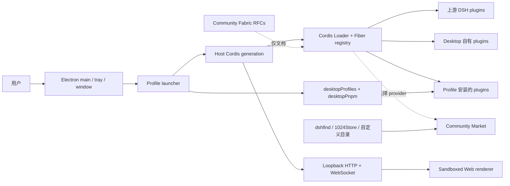

# DSH Desktop 架构

## 总览

DSH Desktop 是一个薄的 Electron 宿主。它在 Electron main 进程中启动官方 DSH Host，Host 再通过 loopback HTTP/WebSocket 提供普通 Web UI。Desktop 没有另造一条 renderer IPC 插件系统，也不把 Electron API暴露给页面。

## 仓库组件与运行时状态

### `deepseek-harness/`

这是固定版本、只读的上游源码子模块，也是独立的 pnpm workspace。它是架构
参考与验证来源，但 Desktop 不会把整个子模块目录当成一个巨大 plugin 加载。
发布应用使用外层 Yarn workspace 固定的 `@deepseek-ai/dsh-*` 与 Cordis
发布包。默认 Desktop profile 只有两个直接 bundle：
`@deepseek-ai/dsh-base` 与 `@deepseek-ai/dsh-web-app`；它们的 patch 会展开
为上游 Host、Client、agent、session、tool、storage、sandbox 与 Web rows。

### `dsh-plugin-desktop/`

这是可执行的 Desktop 产品包，提供：

- `dsh-plugin-desktop` Host plugin；
- `dsh-plugin-desktop/client` Web Client face；
- `profile-service` 与 `pnpm` 两个公开 Desktop service contract；
- Desktop 自有 Host subpath plugins；
- Electron bootstrap、native adapter、打包、恢复与发布验证。

其 package 声明 `dsh.bundle.patch = ./cordis.patch.yml`。每个 generation 中，
launcher 都会把这层 patch 插在上游 Web bundle 之后，而不是把 Desktop
写入用户 profile 的 bundle list。

干净 Desktop composition 当前贡献以下十个 Loader rows：

- `desktop-shell` → `dsh-plugin-desktop`
- `desktop-terminal` → `dsh-plugin-desktop/terminal`
- `desktop-hello-world` → `dsh-plugin-desktop/hello-world`（R&D fixture）
- `desktop-development-canvas` → `dsh-plugin-development-canvas`
- `desktop-diagnostics` → `dsh-plugin-desktop/diagnostics`
- `desktop-notifications` → `dsh-plugin-desktop/notifications`
- `desktop-pnpm` → `dsh-plugin-desktop/pnpm`
- `desktop-profiles` → `dsh-plugin-desktop/profiles`
- `desktop-updates` → `dsh-plugin-desktop/updates`
- `desktop-webserver` → `dsh-plugin-desktop/webserver`（由 profile 生成）

Launcher 自有 service 不一定显示为 Loader row。Launcher 会直接提供
`desktopRuntime` 与 `desktopPnpmBootstrap`，并通过 `ctx.plugin(...)` 挂载
`desktopActions` 和 `desktopProfiles`。它们仍是由 Cordis 管理生命周期的
service，但来源不同于声明式 Loader entry。

### `dsh-plugin-development-canvas/`

Development Canvas 是独立的 Host/Client Cordis package。它自己的 bundle
patch 插入 `desktop-development-canvas`；Host Fiber 拥有 PTY routes 与
processes，Client Fiber 通过 Desktop 声明的 `desktop.main` slot 提供界面。
Desktop 只负责 advanced frame 与 conversation fallback。移除 Canvas row
会直接恢复 fallback，不需要轮询，也不需要 Desktop import Canvas
implementation。

### `dsh-community-market/`

Community Market 已实现，是当前 workspace 中的 private built-in package。
它包含 Host entry、Client entry、catalog contract、持久化 source selection、
经审查的 dshfind 与 1024Store adapter、受限网络访问和 Desktop 托管的包操作。

它是可选 provider，不是始终激活的 plugin。新安装默认 Market selection 为
`disabled`。为下一个 generation 选择 `community-market` 后：

1. Loader tree 插入 `community-market` → `dsh-community-market`；
2. launcher 挂载 `desktopPlugins` service，用于直接 profile bundle inventory
   与 enable/disable 操作；
3. Market Client 在 Settings、sidebar 与 shell overlay 注册贡献。

替代 provider identity 是 `dsh-market` → `dshmarket`。每个 generation
最多只能有一个有效 Market provider。

### `dsh-community-fabric/`

Community Fabric 是 private、仅文档的互操作提案。目前没有 runtime entry、
package export、`dsh.bundle` 声明、已发布 schema、SDK 或 conformance runtime，
因此不会出现在 Loader 或 Fiber registry。当前 plugins 继续使用既有 DSH 与
Cordis contract；Fabric RFC 描述未来可能的跨 Host contract。

## “Plugin registry” 的含义

系统没有一个能代表“所有可能 plugin”的单一 registry。目前有四个相关视图：

1. **Cordis runtime registry（`ctx.registry`）**：底层 Runtime/Fiber 实例及其
   生命周期状态，既包含 Loader 声明的 plugins，也包含从代码挂载的 plugins。
2. **Loader inventory（`ctx.loader` / `pluginInventory/list`）**：按顺序给出
   有效的非 group Loader entries，包括 row id、module specifier、是否启用与
   当前 root Fiber phase。Web Settings 的 **Plugin list** tab 是这个 snapshot
   的只读投影。
3. **Profile bundle inventory（`dsh.profile.bundles` / `desktopPlugins`）**：
   直接安装在 active profile 中的 package-level bundles。每个 bundle 的
   `dsh.bundle.patch` 可以展开成多个 Loader rows。Desktop inventory 可以
   disable 可变 direct bundle，但 Loader 仍是生命周期权威。
4. **Community Market catalog**：来自一个用户选中 source 的远程发现候选。
   内置 source adapter 包括 DSH 1024Store 与 dshfind，也可以添加遵守 contract
   的标准 HTTP source。出现在 catalog 中不代表已经安装、启用、激活、兼容、
   经过审查或安全。

截至 2026-08-24，干净的 macOS Desktop profile 在 compatibility 与 advanced
模式下都会 compose 145 个非 group Loader rows：135 个上游
`@deepseek-ai/*` rows 与 10 个 Desktop rows。其中一些明确 disabled 或受
platform 条件控制，所以“已 compose”不等于“已 active”。此 baseline 中
Market 默认 disabled；选择 Community Market 会增加其 provider row。实时
权威答案始终是 `pluginInventory/list`，因为它直接读取当前 Loader tree 与
Fiber phases，而不是依赖这份文档快照。

### 检查当前状态

- 在 DSH terminal 中运行 `dsh --profile <name> --dump-config`，检查有效的
  声明式 composition 与 patch 顺序。
- 打开 **Settings → Plugins → Plugin list**，读取当前
  `pluginInventory/list` snapshot，包括 enabled state 与 Fiber phase。
- 只有选择 Market provider 后才使用独立的 **Plugin market** tab。其
  Discover/Installable/Installed 视图属于 catalog 与 package-management
  projection，不是 Cordis runtime registry。
- 当 configuration 不能解释 pending、failed 或 unloading 实例时，使用
  `ctx.registry` 与 Fiber diagnostics 调试。

## 启动顺序

1. Electron 获取单实例锁，并读取 Desktop 私有的 profile/mode 状态。
2. Launcher 准备激活 profile，但不会为了列举 profile 而改写用户 profile。
3. Launcher 提供当前 generation 的 native runtime、`desktopProfiles` bootstrap 和内置 pnpm 环境。
4. Host Cordis root 启动 Loader entries。Desktop service 在第三方插件可读取前注册。
5. 官方 `dsh-base`、`dsh-web-app` 和 profile 中的第三方 bundle 组成 Web carrier。
6. Host 绑定 loopback 端口，Electron 创建 BrowserWindow 并加载同源页面。
7. Web surface 成功加载后才创建托盘并提交 profile 的 last-known-good 状态。

任何 profile 或模式切换都会 dispose 当前 generation，再启动新的 generation。Service reference、窗口对象和 subprocess handle 都不能跨 generation 缓存。

## Host、Client 和 native runtime

- **Upstream Host**：agent、model、tool、session、settings、webServer 和 subprocess 等官方能力。
- **Desktop Host**：窗口、托盘、profile、终端、更新，以及对第三方开放的两个 service。
- **Web Client**：官方 Web UI 和第三方浏览器界面。它通过 loopback carrier 工作，不直接调用 Electron。
- **Native runtime**：Electron BrowserWindow、系统托盘、文件/网络/安装器适配。`desktopRuntime` 只供 Desktop 自有 row 使用。

兼容模式的 Client face 校验环境后直接返回，不注册 Desktop layout、root、sidebar 或 conversation override。高级模式才安装 Desktop-owned layout、frame 和原生材质，同时尊重上游和第三方 slot 组合。

### 原生 Shell generation 与平台 adapter

`ElectronRuntime` 负责协调 Host 与原生桌面环境，但不直接拥有窗口和托盘的细节。每次启动由一个 `ElectronShellGeneration` module 完整拥有 `BrowserWindow`、`Tray`、相关 Electron listener、导航限制、外链处理和缩放快捷键。释放 generation 必须通过其幂等 `release()` interface 完成，调用方不能跨 generation 缓存或单独销毁这些资源。

平台差异集中在启动时选择一次的 `ElectronPlatformStrategy` seam。Windows、macOS 与 Linux adapter 声明目录选择、Shell 模式切换和更新下载能力，并负责各自的菜单、Dock 图标与原生材质操作。新的平台分支应进入对应 adapter；generation 与 runtime 中只保留各平台共享的生命周期流程。

## Profile 与服务边界

profile 的名字和绝对目录由 `desktopProfiles.current` 提供，不能从 argv、settings 或 URL 猜测。`list()` 是只读发现；`select()` 记录 pending target，并通过重启完成切换。

`desktopPnpm.run()` 直接跑内置 pnpm；`runPlugin()` 通过打包的 DSH CLI 维持 profile 初始化、相对 source 和 bundle reconcile。两者都属于当前 generation，并由 subprocess service 管理完整进程树。

Launcher 私有的 `desktopRuntime`、`desktopPnpmBootstrap`、Electron executable、Node helper 和 ABI 环境不是第三方 API。公开 contract 只有 `dsh-plugin-desktop/profile-service` 与 `dsh-plugin-desktop/pnpm`。

## 打包与运行时闭包

发布包使用 Electron Builder 和 `app.asar`，但需要物理 unpack 的依赖（例如 pnpm、node-pty、Windows ACL/native 文件）会放在 `app.asar.unpacked`。Packaged runtime gate 会检查 ASAR 入口和物理运行时入口，profile fallback 不能把符号链接指向无法被 Node 解析的虚拟 ASAR 路径。

根 workspace 使用 Yarn；固定的 `deepseek-harness/` 子模块保持上游自己的 pnpm workspace。桌面代码、测试、打包配置和发布脚本属于 `dsh-plugin-desktop/`，不修改上游子模块。

## 维护者深入阅读

- [Plugin 与 registry 可视化](visuals/acr-plugin-registry.html)
- [Desktop service contract](../dsh-plugin-desktop/docs/plugin-services.md)
- [Package README](../dsh-plugin-desktop/README.md)
- [Pinned upstream and isolated Yarn workspace](../.agents/notes/implemented/process/2026-08-15-pinned-upstream-and-isolated-yarn-workspace.md)
- [Profile and pnpm services decision](../.agents/notes/implemented/architecture/2026-08-15-desktop-profile-and-pnpm-services.md)
- [Advanced shell decision](../.agents/notes/implemented/architecture/2026-08-15-desktop-advanced-shell.md)
- [Native shell generation and platform adapters](../.agents/notes/implemented/architecture/2026-08-19-native-shell-generation-and-platform-adapters.md)
