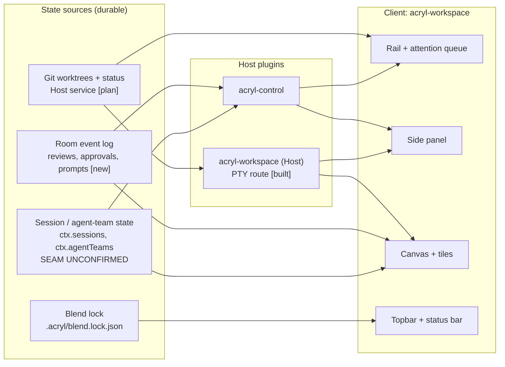

# ACRYL ADE wireframes: where we are, where we go

**Status**: draft, 2026-09-23. Structural only, no visual styling.
**Related**: [spec 040](../../../specs/040-agentic-multiplexer-ade/spec.md), [parity plan](../../../specs/040-agentic-multiplexer-ade/parity-plan.md), mockups v1 (Lovable) and v2 (Base44) under `acryldev/ux-ui-design-mockup-acryl/`.

**How "current" was established.** Read from source (`plugins/acryl-workspace`, `apps/acryl-desktop`), not from a running app or screenshot. Areas owned by upstream DSH are drawn from slot names only, so their exact contents are unverified. Correct this doc after a real launch.

## Legend

| Mark | Meaning |
|---|---|
| `[built]` | Exists in code today |
| `[upstream]` | Provided by the DSH default shell, not ACRYL |
| `[plan]` | Not built; has a spec 040 story or a parity-plan row |
| `[new]` | Not in spec 040; proposed by the parity plan |

---

## 1. Current UX (from code)

`acryl-workspace` takes over the `desktop.main` slot at priority 0 in advanced mode only. It is a **tabbed canvas: one tile fills the main area at a time**, with a `+` menu to add tiles. There is no rail, no side panel, no split layout.

```
+--------------------------------------------------------------------------+
| ADVANCED SHELL FRAME                                        [upstream]   |
| +-------------+------------------------------------------------------+   |
| | SIDEBAR     | desktop.main = acryl-workspace                [built]|   |
| | [upstream]  | +--------------------------------------------------+ |   |
| |             | | TABSTRIP  [◎ Chat x][❯ Term x][▤ File x]  [ + ]  | |   |
| | slot:       | +--------------------------------------------------+ |   |
| | sidebar.    | |                                                  | |   |
| | workspaces  | |   ACTIVE TILE (exactly one visible)              | |   |
| |             | |                                                  | |   |
| | flat list   | |   chat | pty | file | browser | diff | kanban |  | |   |
| | of sessions | |   doc                                            | |   |
| |             | |                                                  | |   |
| |             | +--------------------------------------------------+ |   |
| +-------------+------------------------------------------------------+   |
|                                                                          |
| OVERLAYS: mount-anchor inspector [built], settings + shortcuts [built]   |
+--------------------------------------------------------------------------+
```

### Tile kinds today (`WorkspaceTileKind` in `state.ts`)

| Tile | State | What it really does | Gap vs. a working ADE |
|---|---|---|---|
| `chat` | built | Renders upstream conversation via `renderConversation()` | Not tied to a worktree |
| `pty` | built | Host-owned PTY over a route, xterm.js, disposed with the tile | No split, no scrollback restore |
| `file` | built | Path box plus text area | No tree, no search, no syntax highlighting |
| `browser` | built | Address bar plus embedded frame | No design/annotate mode |
| `diff` | built | Two pasted texts, compared line by line in the client | **Not connected to git.** Manual input only |
| `kanban` | built | One local 3-column board per tile (todo/doing/done) | **Not connected to sessions.** Local cards only |
| `doc` | built | Markdown-ish text with a minimal formatter | Not connected to spec files |

**Spec drift to fix.** Spec 040 says the shipped canvas has three tile kinds (Terminal, File, Browser). The code has seven. Diff, kanban and doc exist as shells with no real data behind them.

---

## 2. Planned UX (target)

Reconciles spec 040 (stories A1-A5), the parity plan (A6-A11), and mockup v2's layout (left rail, right panel, bottom terminal strip, add-picker).

```
+--------------------------------------------------------------------------------+
| TOPBAR   [ACRYL] project / branch      [fan-out] [agents: 3 running] [$ cost]  |
|          [Active BLEND: name]  [Cmd+K]                              [new][plan]|
+----------+------------------------------------------------+--------------------+
| RAIL     | CANVAS (tiles)                                 | SIDE PANEL         |
| [plan A1]| +--------------------------------------------+ | [plan A2]          |
|          | | TABSTRIP  [chat][spec.md][diff][kanban] [+]| | [Files|Changes|    |
| Project  | +--------------------------------------------+ |  Review|Checks]    |
|  > branch| |                                            | |                    |
|   *run   | |  TILE  or  SPLIT of tiles   <-- decision   | | Files   tree+filter|
|   *review| |  chat | pty | file | browser | diff |      | | Changes M/A/D +/-  |
|   o idle | |  kanban | doc | agent-compare[new]         | |   commit box       |
|   . clean| |                                            | | Review  file:line  |
|          | |                                            | |   threads   [new]  |
| ATTENTION| +--------------------------------------------+ | Checks  pass/fail  |
| QUEUE    |                                                |                    |
| [new A7] |                                                |                    |
| needs you|                                                |                    |
| running  |                                                |                    |
| done     |                                                |                    |
+----------+------------------------------------------------+--------------------+
| TERMINAL STRIP (persistent dock, separate from tiles)               [plan]     |
+--------------------------------------------------------------------------------+
| STATUS BAR  branch | worktree path | agent | context usage | rate limit [new]    |
+--------------------------------------------------------------------------------+
```

### Open layout decision (blocks A1/A2 work)

Current canvas is **one tile at a time**. Spec 015 and the parity plan assume **tiles**, and Orca's terminal splits imply **side-by-side**. Pick before building:

| Option | Fits | Cost |
|---|---|---|
| Keep tabs, one tile visible | Current code; simplest; mockup v1 | Cannot watch agent and diff at once, weak for a demo |
| Split panes (resizable) | Orca; mockup v2 canvas; best demo | Needs `ResizablePanelGroup` plus a layout tree in `state.ts` |
| Tabs plus one optional split | Middle path | Small state change, most of the visual win |

Recommendation: tabs plus one optional split. It keeps `WorkspaceState` close to today's shape and still shows agent and diff side by side.

---

## 3. Area-by-area build map

| Area | Today | Planned | Plugin / package | `@acryl/ui` components | Copy or adapt from | Story |
|---|---|---|---|---|---|---|
| Topbar | none | Project, branch, fan-out, agent count, cost, BLEND badge, palette | `acryl-workspace` (new `topbar/`) | `Menubar`, `Command`, `Badge` | Orca `cmd-j`; mockup v2 header | A6, blends |
| Rail | upstream `sidebar.workspaces` | Project > branch tree, status dots, filter | `acryl-workspace` (`rail/`) replaces the sidebar row | `Sidebar`, `Collapsible`, `InputGroup` | Orca `AgentStateDot.tsx`, `store/worktree-*` | A1 |
| Attention queue | none | Sessions bucketed: needs you / running / done, unread | `acryl-workspace` (`rail/attention`) | `Sidebar`, `ScrollArea` | Orca `components/dashboard/` bucket logic | A7 [new] |
| Tab strip | built | Same, plus split toggle | `acryl-workspace` | `Tabs`, `ContextMenu` | none | A1 |
| Split layout | none | One optional split | `acryl-workspace` `state.ts` | `ResizablePanelGroup` | Orca terminal splits (design) | decision |
| Add picker | `+` menu | Named kinds plus "build a card type" | `acryl-workspace` | `Popover`, `Command` | mockup v2 `CanvasAddPicker` | A1 |
| Chat tile | built | Bound to a worktree; approve/reject edits | `acryl-workspace` + upstream conversation | none new | Nimbalyst `PendingReviewBanner.tsx` | A8 [new] |
| Terminal tile | built | Scrollback restore | `acryl-workspace` | none | Orca (verify persistence) | C1 |
| Terminal strip | none | Persistent bottom dock | `acryl-workspace` | `ResizablePanelGroup` | mockup v2 `TerminalStrip` | plan |
| File tile | built (bare) | Tree, filter, Monaco-class editing | `acryl-workspace` | `Sidebar`/tree, `Input` | none decided | A2 |
| Browser tile | built | Design mode: click element, send HTML/CSS/screenshot | `acryl-workspace` + `acryl-mount-anchors` (spec 039) | none | Orca `browser-pane/annotate` | C3 |
| Diff tile | built (pasted text) | Real git diff, side-by-side, line comments to agent | `acryl-workspace` (`tiles/diff`) | `Table`, `ScrollArea` | Orca `diff-comments/` (anchor and range math) | A3, A8 |
| Kanban tile | built (local) | Cards keyed to real session phase | `acryl-workspace` (`tiles/kanban`) | `Card`, drag primitives | Nimbalyst `trackers-ui/board/`, phase model | A4 |
| Doc tile | built | Renders real spec/plan files | `acryl-workspace` | none | none | A5 |
| Agent-compare tile | none | Fan-out results side by side, merge winner | `acryl-workspace` (`tiles/compare`) | `Card`, `Badge` | mockup v2 `MultiAgent.jsx`; Orca parallel worktrees | A6 [new] |
| Side panel | none | Files / Changes / Review / Checks tabs | `acryl-workspace` (`panel/`) | `Tabs`, `Table`, `ScrollArea`, `InputGroup` | Orca `github-checks-tab-state.ts`; mockup v2 `RightPanel` | A2 |
| Interactive prompts | none | Ask, plan approval, commit proposal, permission | `acryl-control` (room events) + Client | `Dialog`, `Sheet` | Nimbalyst `interactivePromptTools.ts`, `GitCommitConfirmationWidget.tsx` | A8 [new] |
| Status bar | none | Branch, worktree, agent, context use, rate limit | `acryl-workspace` | none | Nimbalyst context-usage, rate-limit widgets | A8 |
| BLEND badge | none | Active BLEND identity, "fork this" | Desktop (`desktop-blend.ts`) + workspace | `Badge`, `Dialog` | ours | Blends M4 |
| Settings, shortcuts | built | Unchanged | `acryl-shortcuts` | existing | none | done |
| Mount-anchor inspector | built | Unchanged | `acryl-mount-anchors` | none | none | done |

Component names checked against `plugins/acryl-ui/registry-manifest.yml` on 2026-09-23. Also available and useful here: `SidebarRow`, `ToolCallCard`, `Message`, `Bubble`, `Attachment`, `Kbd`, `EmptyState`. Drag-and-drop for the kanban is not in the registry and would need building.

---

## 4. Data and plugin dependencies

Which real source each planned area reads. The session/phase source is spec 040's open question 2 and gates the rail, attention queue and kanban.



## 5. Build order (matches the parity plan)

1. **Layout decision** above, then extend `WorkspaceState` for it.
2. **Git Host service** (worktrees, status, diff). Everything in the rail and panel needs it.
3. **Rail with status dots** (A1), then **side panel** (A2), then **real diff tile** (A3).
4. **Attention queue** (A7) on the same session source as the rail.
5. **Review loop** (A8): line comments, approve/reject, durable prompts.
6. **Fan-out compare tile** (A6) and **BLEND badge** (Blends M4).

## 6. Unverified items to check after a real launch

- Exact contents of the upstream sidebar and how the advanced frame lays out around `desktop.main`.
- Whether the Web surface has any of this at all: `acryl-mount-anchors` notes that `acryl-web` declares no advanced-shell slots, so the whole layout above is **Desktop-only** unless Web gets a frame.
